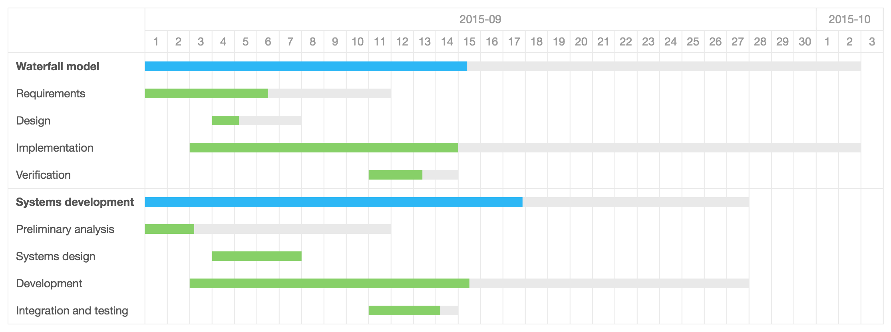

Gantt Chart
=====

[](https://www.npmjs.com/package/gantt)
[](https://www.npmjs.com/package/gantt)

## Install

```bash
$ npm install gantt
```

## Usage

[Example](example/)

```
var Gantt = require('gantt');

var data = [{
  id: 1,
  name: 'group 1',
  collapse: false,
  children: [{
    id: 11,
    name: 'task 11',
    from: new Date('2015-09-01 00:00:00'),
    to: new Date('2015-09-12 00:00:00'),
    percent: 50
  }]
}, {
  id: 2,
  name: 'group 2',
  children: [{
    id: 21,
    name: 'task 21',
    from: new Date('2015-09-07 00:00:00'),
    to: new Date('2015-9-10 00:00:00'),
    percent: 20
  }]
}];

var gantt = new Gantt('root', data, options);
```




## Develop

```
# Dev
$ dool server

# Build
$ dool build
```

## Options & API

```
// Default options
{
  type: 'day',
  fontSize: 14,
  fontFamily: 'Helvetica Neue,Helvetica,PingFang SC,Hiragino Sans GB,Microsoft YaHei,SimSun,sans-serif',
  padX: 10,
  padY: 10,
  cellWidth: 28,
  cellHeight: 28,
  color: '#555',
  lineColor: '#e9e9e9',
  hColor: '#999',
  barColor1: '#2db7f5',
  barColor2: '#87d068',
  barBgColor: '#e9e9e9'
}
```

- setType(type): change gantt chart style `day|week|month`
- setData(data): change gantt data
- toBlob(callback, type, quality): gantt chart to Blob data

## Report a issue

* [All issues](https://github.com/d-band/gantt/issues)
* [New issue](https://github.com/d-band/gantt/issues/new)

## License

gantt is available under the terms of the MIT License.
