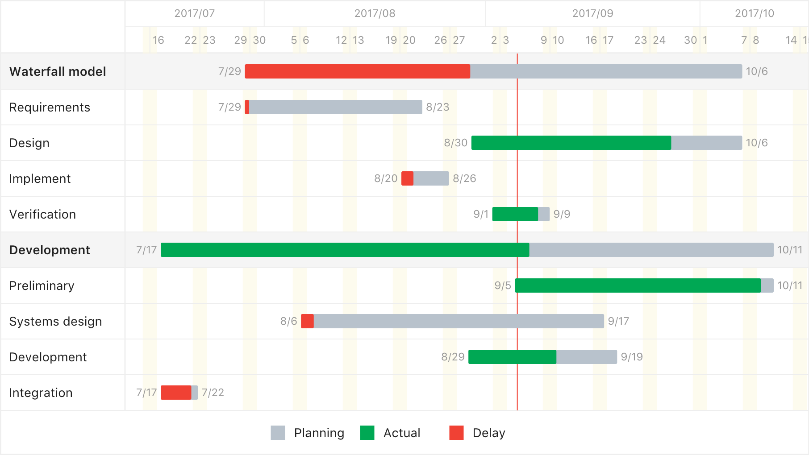

Gantt Chart
===========

> Gantt chart library using jsx support SVG, Canvas and SSR

[](https://www.npmjs.com/package/gantt)
[](https://www.npmjs.com/package/gantt)
[](https://greenkeeper.io/)

## Install

```bash
$ npm install gantt --save
```

## Usage

```javascript
import { SVGGantt, CanvasGantt, StrGantt } from 'gantt';

const data = [{
  id: 1,
  name: 'group 1',
  children: [{
    id: 11,
    name: 'task 11',
    from: new Date('2015-09-01 00:00:00'),
    to: new Date('2015-09-12 00:00:00'),
    percent: 0.5
  }]
}];

new SVGGantt('#svg-root', data, {
  viewMode: 'week'
});

new CanvasGantt('#canvas-root', data, {
  viewMode: 'week'
});

const strGantt = new StrGantt(data, {
  viewMode: 'week'
});
this.body = strGantt.render();
```



## Options

```javascript
{
  // View mode: day/week/month
  viewMode: 'week',
  offsetY: 60,
  rowHeight: 40,
  barHeight: 16,
  thickWidth: 1.4,
  footerHeight: 50,
  styleOptions: {
    BG: '#fff',
    groupBG: '#f5f5f5',
    lineColor: '#eee',
    redLineColor: '#f04134',
    baseBar: '#b8c2cc',
    greenBar: '#00a854',
    redBar: '#f04134',
    textColor: '#222',
    lightTextColor: '#999',
    lineWidth: '1px',
    thickLineWidth: '1.4px',
    fontSize: '14px',
    smallFontSize: '12px',
    fontFamily: '-apple-system, BlinkMacSystemFont, "Segoe UI", Roboto, "Helvetica Neue", Arial, sans-serif'
  }
}
```

## Report a issue

* [All issues](https://github.com/d-band/gantt/issues)
* [New issue](https://github.com/d-band/gantt/issues/new)

## License

Gantt is available under the terms of the MIT License.
